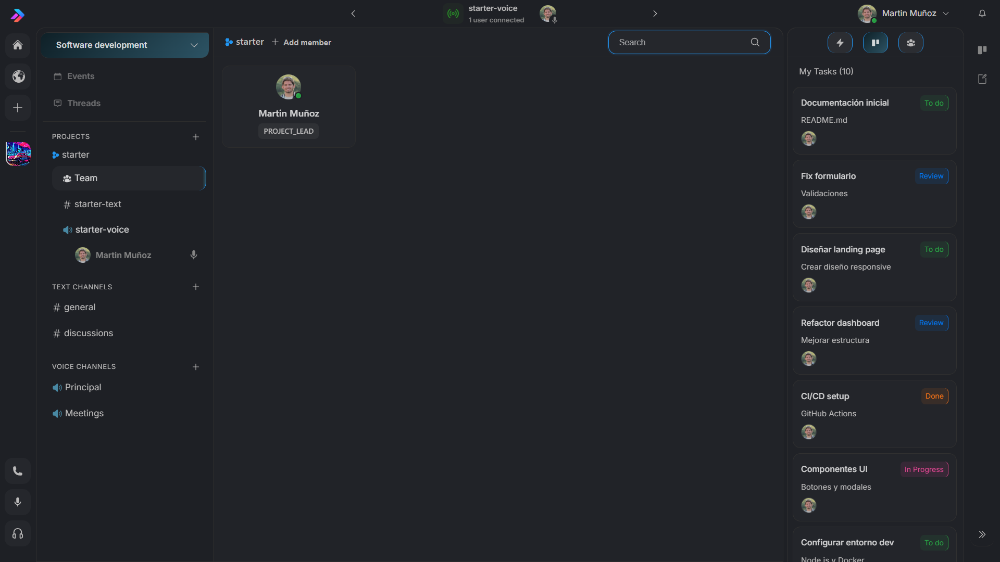
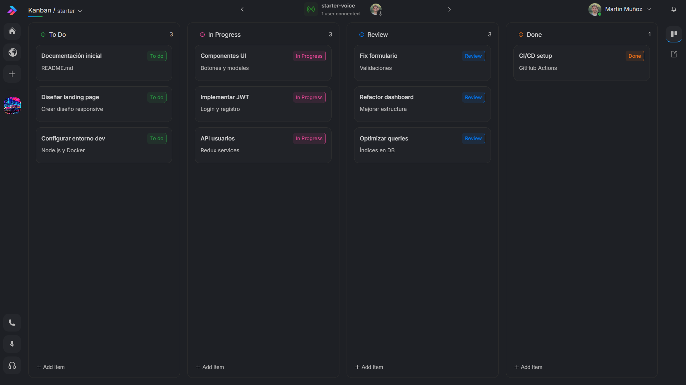
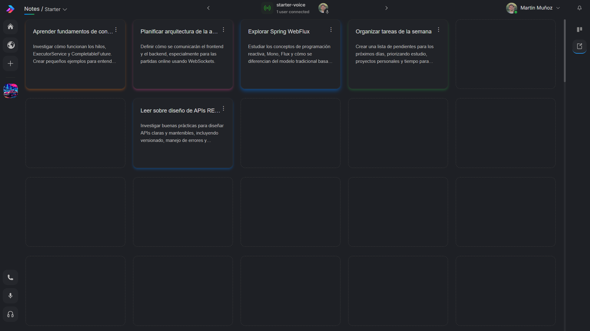
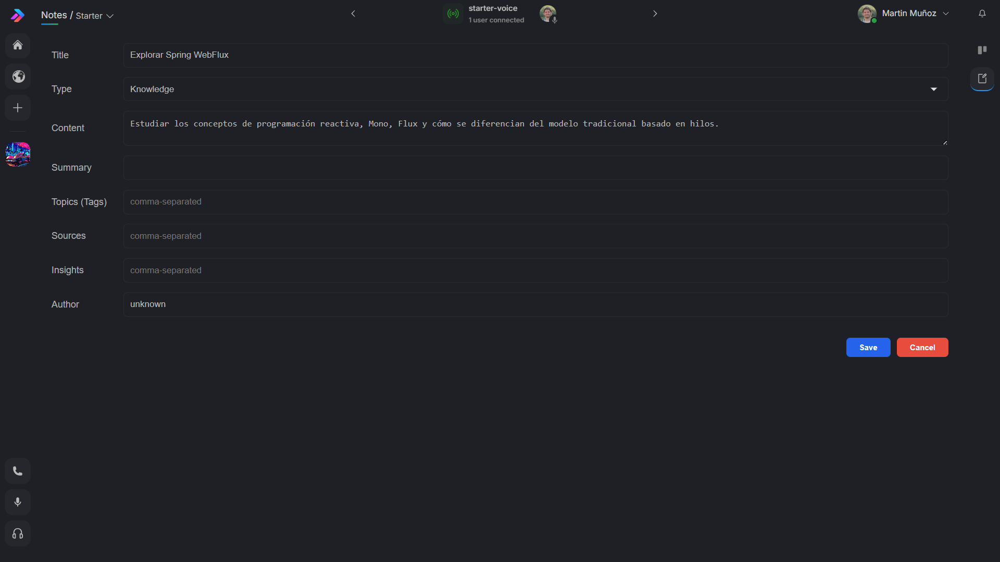
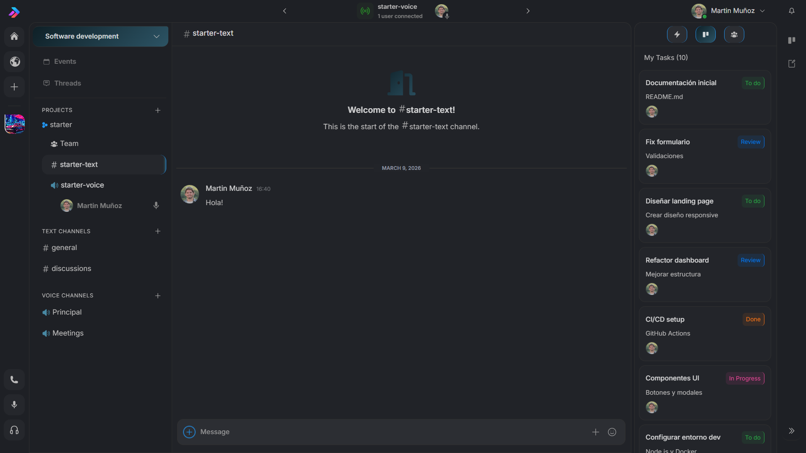

# Agile Team Platform

A collaborative platform designed for agile teams to communicate, organize tasks, and coordinate work in real time.

This project is a **full-stack application** built with a Java backend and a modern JavaScript frontend.

---

## 🚀 Features

* Real-time team communication
* Task and workflow organization
* Agile team collaboration tools
* REST API for client-server communication
* Real-time updates using WebSockets

---

## 📸 Screenshots

### 👥 Team Manager
> Manage your team members and view their roles within the project.



---

### 📋 Kanban Board
> Visualize and manage tasks across columns: To Do, In Progress, Review, and Done.



---

### 📝 Notes
> Organize knowledge, ideas, and references in a grid-based notes view.



---

### ✏️ Note Editor
> Create and edit notes with fields for title, type, content, tags, sources, and insights.



---

### 💬 Text Channels & Tasks Sidebar
> Real-time text communication combined with a persistent task sidebar for quick access.



---

## 🧱 Tech Stack

### Backend

* Java
* Spring Boot
* REST API
* WebSockets
* Maven

### Frontend

* React
* Vite
* JavaScript / TypeScript

---

## 📂 Project Structure

```
agile-team-platform
│
├── backend
│   └── Spring Boot API
│
├── frontend
│   └── React client application
│
└── README.md
```

---

## 🗄️ Database Schema

> Entity-relationship diagram showing the main tables and their relationships.


## ⚙️ Running the Project

### 1️⃣ Clone the repository

```
git clone https://github.com/your-username/agile-team-platform.git
```

---

### 2️⃣ Run the backend

Navigate to the backend folder:

```
cd backend
```

Run the Spring Boot application:

```
./mvnw spring-boot:run
```

or in Windows:

```
mvnw.cmd spring-boot:run
```

The backend will start on:

```
http://localhost:8080
```

---

### 3️⃣ Run the frontend

Navigate to the frontend folder:

```
cd frontend
```

Install dependencies:

```
npm install
```

Start the development server:

```
npm run dev
```

The frontend will start on:

```
http://localhost:5173
```

---

## 📡 Architecture

```
React Frontend
       │
       │ REST API / WebSocket
       ▼
Spring Boot Backend
       │
       ▼
Database
```

---

## 🎯 Purpose of the Project

This project was built to explore:

* full-stack architecture
* real-time communication with WebSockets
* API design with Spring Boot
* modern frontend development with React

---

## 👨‍💻 Author

Martin Muñoz  
Backend Developer focused on building REST APIs and real-time applications using the Spring ecosystem.
